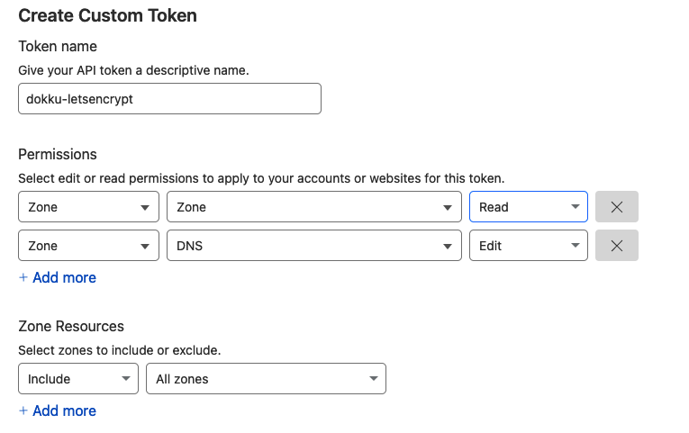

# Infraestructura

This repo contains ansible playbooks for automated deployments of dokku servers and apps.

The playbooks themselves were specifically designed around the needs of deploying [supergood.site](https://supergood.site), but the roles and general setup could be useful to other projects.

## Table of Contents

- [Table of Contents](#table-of-contents)
- [Setup](#setup)
  - [1. Install Dependencies](#1-install-dependencies)
  - [2. Create local .env and var files](#2-create-local-env-and-var-files)
  - [3. Set up External Services](#3-set-up-external-services)
    - [Namecheap](#namecheap)
    - [Hetzner](#hetzner)
    - [Cloudflare](#cloudflare)
- [Run](#run)
  - [1. Source your .env variables in your shell](#1-source-your-env-variables-in-your-shell)
  - [2. Provision your Hetzner server](#2-provision-your-hetzner-server)
  - [3. Configure your Hetzner server](#3-configure-your-hetzner-server)
  - [4. Install Dokku](#4-install-dokku)
  - [5. Create apps](#5-create-apps)
- [Development Guide](#development-guide)
  - [Creating Dokku Apps](#creating-dokku-apps)
    - [1. Define your apps](#1-define-your-apps)
    - [2. Set up local environment](#2-set-up-local-environment)
    - [3. Set app configs](#3-set-app-configs)
    - [4. Set Environment Variables](#4-set-environment-variables)
    - [5. Make additional configuration steps, as needed](#5-make-additional-configuration-steps-as-needed)
    - [6. Apply changes](#6-apply-changes)
  - [ssh into servers](#ssh-into-servers)
- [Areas for Improvement](#areas-for-improvement)
  - [Use ansible-vault for secrets.yml management](#use-ansible-vault-for-secretsyml-management)
  - [Add ACL (Access Control Lists) for dokku apps](#add-acl-access-control-lists-for-dokku-apps)
- [Thanks](#thanks)

## Setup

### 1. Install Dependencies

First, you'll need `ansible` installed on your local machine.

After that, install the project's additional ansible galaxy dependencies.

```bash
make install
```

Then install the python dependencies required by those ansible galaxy dependencies and local `setup.py` scripts.

```bash
pip install .
```

(or `pip install -e .` if you're still editing your `setup.py` scripts.)

### 2. Create local .env and var files

```bash
ansible-playbook playbooks/setup_local.yml
```

### 3. Set up External Services

To use these playbooks to build servers completely from scratch, there are a couple of manual steps to do with external service providers.

#### Namecheap

Buy a domain from [Namecheap](https://www.namecheap.com/) or any other Domain registrar.

#### Hetzner

This project builds its servers on [Hetzner](https://www.hetzner.com/cloud) VMs.

Take these steps to enable the `provision_server.yml` playbook to automatically provision  servers for your dokku project to use.

1. Create an account in Hetzner Cloud
   - Note: it can take a couple of days for your account to be verified. It took 5 days for mine.
2. Create a new project within Hetzner Cloud.
3. Generate an API token for that project.
4. Add that API token as `HCLOUD_TOKEN` in `.env`.

#### Cloudflare

This project uses Cloudflare as the DNS hosting service for mapping your domains ([example.com)](#) to the IP addresses (93.184.216.34) of your Hetzner servers.

Take these steps to enable the `provision_server.yml` playbook to automatically create your Cloudflare DNS records.

1. Create a free Cloudflare account
2. Add your domain as a "website" (a.k.a "zone").
3. Follow their instructions. Within Namecheap, you'll have to add Cloudflare's nameservers as a Custom DNS within your domain settings.
      - Note: They claim it can take up to 48 hours for the changes to register. It took about 2 hours for me. You can manually check that your domain has been registered with:
        ```bash
        nslookup -type=TXT your-domain
        ```
4. Back in Cloudflare, create an API token that has permission to edit your (website) zone's "DNS" and "Zone Settings". Set this as `CLOUDFLARE_TOKEN` in `.env`.
  
5. Create another API token with permission to read "Zone" and edit "DNS". Set this as `LETSENCRYPT_CLOUDFLARE_DNS_API_TOKEN` in `.env`. This token will be stored on your remote dokku server to be used later by letsencrypt.
  

## Run

### 1. Source your .env variables in your shell

Do this after every time you change them.

```shell
set -a; source .env; set +a
```

### 2. Provision your Hetzner server

Build the server that will host your dokku instance, along with DNS records.

```bash
ansible-playbook -i inventories/staging playbooks/provision_server.yml
```

**Notes**

  - `-i inventories/staging` runs playbooks on your staging server.
  - `-i inventories/production` runs playbooks on your production server.
  - Test that your dokku server has been provisioned with:
    ```bash
    ansible-inventory -i inventories/staging --list
    ```

### 3. Configure your Hetzner server

This installs core packages, creates a sudoless remote_user, and does basic security hardening.

```bash
ansible-playbook -i inventories/staging playbooks/configure_server.yml
```

**Notes**

  - Test that your playbook's `new_remote_user` (which should match the remote_user in `ansible.cfg`) has access to your servers:
    ```bash
    ansible -i inventories/staging supergood_cloud -m ping
    ```

### 4. Install Dokku

Install dokku on your Hetzner servers and set up initial global configs.

```bash
ansible-playbook -i inventories/staging playbooks/install_dokku.yml
```

### 5. Configure apps

Follow the development guide below to configure your dokku apps. Then run this playbook to create or update app instances on your dokku server.

```bash
configure_apps staging
```

Now you'll have a dokku app environment ready for you to deploy containers to.

### 6. Deploy app

This is done on your own. See the [official docs](https://dokku.com/docs/deployment/application-deployment/#deploy-the-app) for details.

### 7. Enable encryption

Once your app is deployed, then you can enable letsecrypt SSL for it.

If you deployed with a Dockerfile or `git:from-image`, then you must set `docker_deploy: true` in your app `[app_name].secrets.yml`. [Read more](https://github.com/dokku/dokku-letsencrypt#dockerfile-and-image-based-deploys)

```sh
ansible-playbook -i inventories/staging playbooks/encrypt_apps.yml
```

## Development Guide

### Creating Dokku Apps

An "app" in dokku is not the same as the actual web application that you want to deploy on your dokku server. The dokku app is everything that will surround your actual web application: the database services, networking, routing, environment variables.

These steps will put everything in place so that you'll have a dokku app to which you can `push`` your containers.

#### 1. Define your apps

The first step is to define the names of the apps you want to build.

The source of truth for this lives in `inventories/{{env}}/group_vars/all/main.yml`.

Example:
```yaml
apps:
  - supergood-site
  - supergood-reads
```

`setup_local_app_configs.yml` and `configure_apps.yml` look to this var to determine which apps to configure.

#### 2. Set up local environment

Once you have your `apps` defined in `inventories/{{env}}/group_vars/all/main.yml`, running `setup_local_app_configs.yml` will automatically build all the local app config files they'll need.

```bash
ansible-playbook -i inventories/staging playbooks/setup_local_app_configs.yml
```

This builds a default `inventories/{{env}}/apps/{{ app_name }}.secrets.yml` file and other placeholder configs for your apps.

#### 3. Set app configs

Your new `{{ app_name }}.secrets.yml` contains some configuration options that will be parsed by `playbooks/roles/dokku_app/tasks/default_config.yml`. Change those values as needed.

#### 4. Set Environment Variables

Your app's newly created `inventories/{{env}}/apps/{{ app_name }}.secrets.yml` has a place for setting environment variables. All environment variables should be listed under `config`.

Note: only string values are allowed.

Example:
```yaml
config:
  DEBUG: "0"
  SECRET_KEY: "3dc305fe2263859fc25a0"
```

Any future changes to your environment variables can be re-deployed using the same `configure_app.yml` playbook:
```bash
configure_apps staging --app=your_app_name
```

#### 5. Make additional configuration steps, as needed

If your dokku app requires additional build steps beyond the tasks defined in `default_config.yml`, you can define those on a per-app basis within `playbooks/apps/{{ app_name }}/tasks/extended_config.yml`. Those tasks will be run by the `configure_apps.yml` playbook. This should help reduce the number of adhoc `dokku` commands that you need to manually run on the server to get your apps configured.

Additional scripts or files used by your app's `extended_config.yml` should live in the `playbooks/apps/{{ app_name }}/` directory.

#### 6. Apply changes

You can apply any of those changes to your dokku app with:

```bash
configure_apps staging --app=your_app_name
```

Note the use of `--tags` to target only one app, rather than every dokku app living on the staging server.


### ssh into servers

Any dokku configuration changes should be committed in code (probably in `roles/dokku_app/tasks/default_config.yml` or `roles/dokku_initial_setup/tasks/main.yml` or `extended_config.yml`).

But there are still some situations when you might need to manually inspect or restart a service.

You can ssh into your dokku host server using this utility:
```bash
ssh-env staging
```

## Areas for Improvement

This project has a lot of good practices going for it, but it was also designed with a sole user in mind.

To make this project structure work for multiple users I would recommend making these changes:

### Use ansible-vault for secrets.yml management

Right now, secrets live only on the localhost machine in gitignored files. A more resilient and collaborative approach would be to save them in ansible-vault encrypted files that could be shared with other developers on a private github repo.

### Add ACL (Access Control Lists) for dokku apps

When you have multiple users and multiple apps, you will want to restrict who has permission to do what on each app.

This sample project has an approach that might be useful: https://github.com/ltalirz/ansible-playbook-dokku/tree/master.

## Thanks

These sources were immensely helpful to my understanding of dokku and ansible:

- [Ansible Up and Running 3rd. Edition](http://www.ansiblebook.com/) was immensely helpful for teaching me the basics of how anisble works.
- Tom Dyson's [short guide](https://gist.github.com/tomdyson/025be30855262287ae048bf4371d26f8) is the absolute easiest MVP for how to deploy dokku on your own server.
- [Márton Salomváry](https://salomvary.com/about)'s blog post on installing [dokku with ansible](https://salomvary.com/setting-up-dokku) gave me the foundation for building this project.
- Justin Ellingwood's article on using [multiple inventories for deployment environments](https://www.digitalocean.com/community/tutorials/how-to-manage-multistage-environments-with-ansible#ansible-recommended-strategy-using-groups-and-multiple-inventories) helped make this concept finally click for me.
